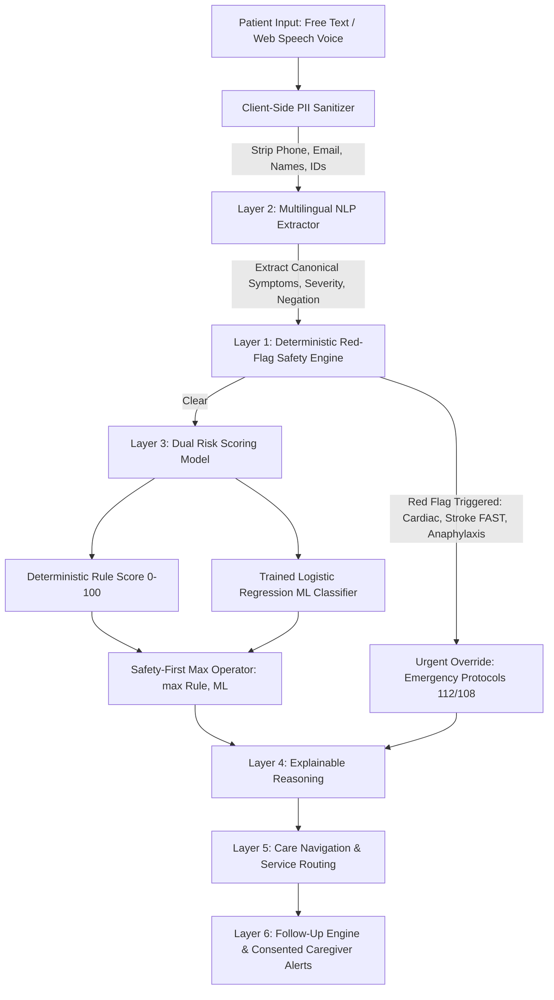

# CareCompass: AI Health Risk Awareness & Care Navigation

**CareCompass** is an ethical, safety-first clinical decision-support and health risk awareness web application. It guides individuals to understand early warning symptoms, directs them to the appropriate level of medical care (from self-monitoring to emergency ambulance dispatch), and maintains continuous follow-up tracking with consented family caregiver alerts.

> **CRITICAL MEDICAL DISCLAIMER**:
> CareCompass is a health awareness and decision-support tool. It is **NOT** a diagnostic system. It never names definitive diagnoses, never prescribes medications or dosages, and never replaces a licensed doctor. In any life-threatening emergency, dial **112** or **108** immediately.

---

## 🏛️ Hybrid Multi-Layer Architecture



### Layer Breakdown
1. **Layer 1: Deterministic Red-Flag Safety Engine** (Auditable & Non-Bypassable):
   - Runs prior to any statistical classification.
   - Evaluates acute conditions (angina with radiation/sweating, FAST stroke signs, airway compromise, infant neonatal fever, severe hemorrhage).
   - Unconditionally overrides the risk category to `Urgent` and activates emergency direct-calling (112 / 108).
2. **Layer 2: Multilingual NLP Extractor**:
   - Structured JSON schema powered by Google Gemini 3.8 Flash (`@google/genai`) via Express proxy `/api/extract-symptoms`.
   - Client-side regex & dictionary fallback supporting English, Hindi (हिन्दी), Telugu (తెలుగు), and transliterations (Hinglish/Tenglish) with negation detection ("no fever", "bukhar nahi hai", "jwaram ledu").
3. **Layer 3: Dual Risk Scorer**:
   - Evaluates clinical severity curves and demographic multipliers (age vulnerability, pregnancy, diabetes, hypertension).
   - Computes logistic regression probabilities from a synthetic clinical triage dataset.
   - Reconciles both scores using a **Safety-First Maximum Operator** (always selects the more cautious category).
4. **Layer 4: Explainable Reasoning Engine**:
   - Generates non-diagnostic descriptive warning patterns (e.g., "Cardiovascular Precautionary Pattern").
   - Normalized feature contribution bar chart explaining "Why this result?".
   - Counterfactual reasoning ("What would change this category?").
   - Plain-language explanation at a 6th-grade reading level.
   - Text-to-Speech (TTS) audio playback.
5. **Layer 5: Care Navigation & Service Routing**:
   - Maps severity to appropriate care: Self-care, Community Pharmacist, Teleconsultation, GP Clinic Visit, Specialist, or Emergency Department.
   - Mock nearby facility directory with contact information and directions.
   - Clinical handover summary formatted according to the healthcare **SBAR** standard (Situation, Background, Assessment, Recommendation).
6. **Layer 6: Follow-up Scheduling & Caregiver Safety Net**:
   - Auto-generates scheduled recovery milestones with snooze and completion tracking.
   - Granular caregiver consent controls with simulated SMS/push alert escalation for missed check-ins or urgent risks.

---

## ⚡ Quick Start (Setup in 4 Commands)

```bash
# 1. Install dependencies
npm install

# 2. Configure environment
cp .env.example .env
# (Optional) set your GEMINI_API_KEY in .env

# 3. Start full-stack development server
npm run dev

# 4. Open in browser
# Visit http://localhost:3000
```

---

## 🧪 Built-in Automated Unit Tests

CareCompass includes an in-app test harness covering:
- Cardiac red-flag trigger verification (`RF-CARDIAC-01`)
- FAST stroke sign identification (`RF-STROKE-FAST`)
- Neonatal fever triage (< 3 months age)
- Negation handling resilience (English & Hindi)
- Dual scoring safety reconciliation
- Client-side PII scrubbing

Click the **Pipeline Live View** button in the navigation header and select **Automated Unit Tests** to run all suites in real time.

---

## ⏱️ 3-Minute Demo Script for Judges

1. **Minute 1: Landing & Low Risk Scenario**
   - Click **"Scenario 1: Mild Sore Throat (Low Risk)"**.
   - Observe how "no fever" is captured as a negation chip.
   - Result: Categorized as **Low Risk**; routes to **Self-Care & Home Monitoring**; schedules a **48-Hour Recovery Check-in** reminder.
2. **Minute 2: Needs Attention & Hindi Multilingual Intake**
   - Click **"Scenario 2: Fever in Elderly Diabetic (Needs Attention)"**.
   - Review how age (62y) and comorbidity (Diabetes) elevate the risk score.
   - Open **"Prepare Doctor Consultation SBAR"** to inspect the printable clinical handover.
   - Switch language to **हिन्दी** or **తెలుగు** to observe full multilingual UI localization.
3. **Minute 3: Urgent Red Flag & Live Technical Inspector**
   - Click **"Scenario 3: Acute Chest Pain + Left Arm + Sweating"**.
   - Observe the immediate **Emergency Banner** with one-tap dialing to **112** and **108**.
   - Click **"Alert Family Caregiver Now"** to view the simulated SMS dispatch to Sunita Sharma.
   - Click the **"Pipeline Live View"** terminal button in the top navigation to inspect the live 6-stage telemetry trace and run the unit test harness!

---

## 🛡️ Responsible AI & Privacy Guarantees

- **No Diagnostic Pronouncements**: Does not label illnesses as definitive facts.
- **No Prescriptions**: Never recommends pharmaceutical dosages or antibiotic treatments.
- **Local-First Storage**: Patient data is saved exclusively to browser local storage.
- **Data Minimization**: Zero PII (names, phone numbers, email addresses, government IDs) leaves the client device.
- **Patient Sovereignty**: One-click complete JSON data export and one-click permanent data wipe.
